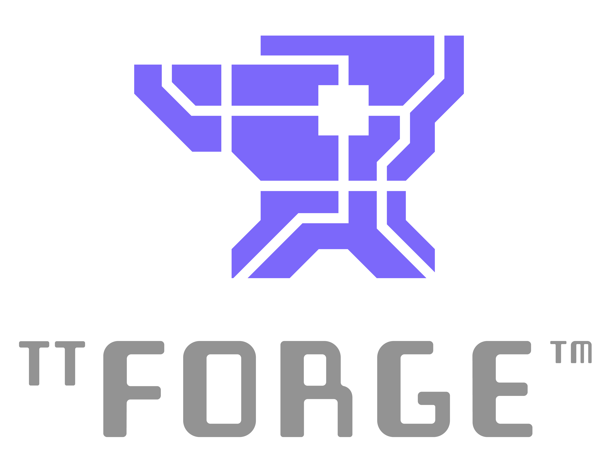
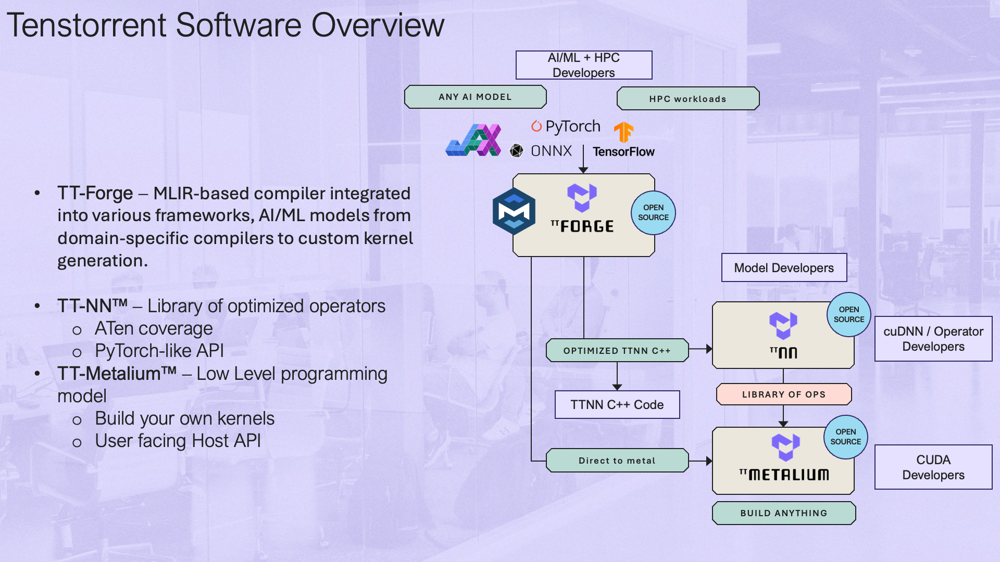

<div align="center">

<h1>

 [Hardware](https://tenstorrent.com/cards/) | [Documentation](https://docs.tenstorrent.com/tt-forge/) | [Discord](https://discord.gg/tenstorrent) | [Join Us](https://job-boards.greenhouse.io/tenstorrent?gh_src=22e462047us) | [Bounty $](https://github.com/tenstorrent/tt-forge/issues?q=is%3Aissue%20state%3Aopen%20label%3Abounty)

</h1>
<picture>
  
</picture>

</div>
<br>

TT-Forge is Tenstorrent's open-source AI compiler stack, built on [TT-Metalium](https://github.com/tenstorrent/tt-metal). It brings together frontends, an MLIR compiler, a kernel DSL, and a model library to make running AI workloads on Tenstorrent hardware straightforward — 800+ model variants tested in CI, thousands more ran internally, if it fits in memory, it should run.

Models like GPT-OSS 120B, Llama 3 70B, Stable Diffusion XL, Whisper, and YOLOv12 — all running today from PyTorch, JAX, and ONNX. Inference and training, custom kernels to full models — all open source.

-----
**Contents:** [Sub-Projects](#tt-forge-sub-projects) · [Run a Model](#run-a-model) · [Train a Model](#train-a-model) · [Write a Custom Kernel](#write-a-custom-kernel) · [Tested Models](#tested-models) · [Architecture](#architecture) · [FAQ](#faq)

-----
# TT-Forge Sub-Projects

| Project | What It Does | Links |
|---------|-------------|-------|
| **[TT-XLA](https://github.com/tenstorrent/tt-xla)** | Primary frontend for **PyTorch** and **JAX** models. Uses the PJRT interface to compile models into StableHLO graphs for TT-MLIR. Supports single and multi-chip. | [Docs](https://docs.tenstorrent.com/tt-xla/) · [Demos](https://github.com/tenstorrent/tt-forge/tree/main/demos/tt-xla) |
| **[TT-Forge-ONNX](https://github.com/tenstorrent/tt-forge-onnx)** | TVM-based frontend for **ONNX**, **TensorFlow**, and **PaddlePaddle** models. Single-chip only. | [Docs](https://docs.tenstorrent.com/tt-forge-onnx/) · [Demos](https://github.com/tenstorrent/tt-forge/tree/main/demos/tt-forge-onnx) |
| **[TT-MLIR](https://github.com/tenstorrent/tt-mlir)** | Core MLIR-based compiler. Defines TTIR, TTNN, and TTKernel dialects, applies optimization passes (fusion, sharding, layout), and lowers to TT-Metalium. | [Docs](https://docs.tenstorrent.com/tt-mlir/) · [Tools](https://docs.tenstorrent.com/tt-mlir/tools.html) |
| **[TT-Lang](https://github.com/tenstorrent/tt-lang)** | Python DSL for custom high-performance kernels. Write fused ops in Python with built-in simulation, profiling, and AI-assisted translation from Triton-class DSLs. *(Early preview)* | [Docs](https://github.com/tenstorrent/tt-lang#readme) |
| **[TT-Blacksmith](https://github.com/tenstorrent/tt-blacksmith)** | Optimized training recipes and experiments. 40+ examples spanning PyTorch, JAX, and Lightning across vision models, LLMs, and NLP. | [Docs](https://docs.tenstorrent.com/tt-blacksmith/) · [Experiments](https://docs.tenstorrent.com/tt-blacksmith/src/experiments.html) |
| **[TT-Forge-Models](https://github.com/tenstorrent/tt-forge-models)** | 800+ model variants continuously tested in CI. Standardized loaders for LLMs, vision, NLP, multimodal, detection, segmentation, speech, and more. | [Repo](https://github.com/tenstorrent/tt-forge-models) |

-----
# Run a Model

Get ResNet-50 running on Tenstorrent hardware in minutes:

```bash
pip install pjrt-plugin-tt --extra-index-url https://pypi.eng.aws.tenstorrent.com/
pip install torchvision
```

```python
import torch
import torch_xla.core.xla_model as xm
import torch_xla.runtime as xr
from tt_torch.backend.backend import xla_backend
from torchvision.models import resnet50, ResNet50_Weights

# Set device to Tenstorrent
xr.set_device_type("TT")
device = xm.xla_device()

# Load ResNet-50
model = resnet50(weights=ResNet50_Weights.DEFAULT).to(torch.bfloat16).eval()
compiled_model = torch.compile(model, backend=xla_backend)
compiled_model = compiled_model.to(device)

# Run inference on Tenstorrent
input_tensor = torch.randn(1, 3, 224, 224, dtype=torch.bfloat16).to(device)
with torch.no_grad():
    output = compiled_model(input_tensor)

predicted_class = output.cpu().argmax(dim=-1).item()
print(f"Predicted ImageNet class: {predicted_class}")
```

> **Note:** Wheels are hosted on [Tenstorrent's package index](https://pypi.eng.aws.tenstorrent.com/). The `--extra-index-url` flag is required until packages are available on public PyPI.

See the full [Getting Started Guide](https://docs.tenstorrent.com/tt-forge/getting_started.html) for all setup options. For ONNX models, see [TT-Forge-ONNX](https://github.com/tenstorrent/tt-forge-onnx). More demos in [TT-XLA demos](https://github.com/tenstorrent/tt-forge/tree/main/demos/tt-xla).

-----
# Train a Model

Standard PyTorch training example runs on Tenstorrent hardware via [TT-Blacksmith](https://github.com/tenstorrent/tt-blacksmith):

```bash
git clone https://github.com/tenstorrent/tt-blacksmith.git && cd tt-blacksmith
source env/activate --xla
```

```python
import torch
import torch_xla
import torch_xla.core.xla_model as xm

# Standard PyTorch — the only difference is the device
xr.set_device_type("TT")
device = torch_xla.xla_device()

model = MyModel().to(device)
optimizer = torch.optim.SGD(model.parameters(), lr=0.01)
loss_fn = torch.nn.CrossEntropyLoss()

for inputs, targets in train_loader:
    inputs, targets = inputs.to(device), targets.to(device)

    outputs = model(inputs)
    loss = loss_fn(outputs, targets)
    loss.backward()

    optimizer.step()
    torch_xla.sync(wait=True)
    optimizer.zero_grad()
```

40+ ready-to-run training recipes - LLama, Gemma, Qwen, ViT, NeRF, and more. See the [experiments table](https://docs.tenstorrent.com/tt-blacksmith/src/experiments.html).

-----
# Write a Custom Kernel

[TT-Lang](https://github.com/tenstorrent/tt-lang) *(early preview)* — write high-performance kernels in Python instead of low-level C++:

```python
import ttl

@ttl.kernel(grid=(1, 1))
def fused_mul_add(a, b, c, y):
    # Set up dataflow buffers for producer-consumer communication
    a_dfb = ttl.make_dataflow_buffer_like(a, shape=(1, 1), buffer_factor=2)
    b_dfb = ttl.make_dataflow_buffer_like(b, shape=(1, 1), buffer_factor=2)
    c_dfb = ttl.make_dataflow_buffer_like(c, shape=(1, 1), buffer_factor=2)
    y_dfb = ttl.make_dataflow_buffer_like(y, shape=(1, 1), buffer_factor=2)

    @ttl.compute()
    def compute():
        with (
            a_dfb.wait() as a_blk,
            b_dfb.wait() as b_blk,
            c_dfb.wait() as c_blk,
            y_dfb.reserve() as y_blk,
        ):
            y_blk.store(a_blk * b_blk + c_blk)  # y = a * b + c

    @ttl.datamovement()
    def read():
        with (
            a_dfb.reserve() as a_blk,
            b_dfb.reserve() as b_blk,
            c_dfb.reserve() as c_blk,
        ):
            ttl.copy(a[0, 0], a_blk).wait()
            ttl.copy(b[0, 0], b_blk).wait()
            ttl.copy(c[0, 0], c_blk).wait()

    @ttl.datamovement()
    def write():
        with y_dfb.wait() as y_blk:
            ttl.copy(y_blk, y[0, 0]).wait()
```

Python in, optimized hardware code out. The compiler handles NOC addressing, register allocation, and memory management. See the [TT-Lang repo](https://github.com/tenstorrent/tt-lang) for tutorials, simulation, and profiling tools.

-----
# Tested Models

800+ model variants in the [model library](https://github.com/tenstorrent/tt-forge-models), continuously tested in CI — with thousands more ran internally. Highlights:

| Category | Models |
|----------|--------|
| **LLMs** | Llama 3.1/3.2 (1B–70B), Qwen 2.5/3 (0.5B–32B), Falcon-3 (1B–10B), Phi-1/2/3/3.5, Gemma 1.1/2 (2B–7B), Mistral/Ministral (7B–24B), Mamba 2.8B |
| **Vision** | ResNet-50, ViT, EfficientNet, MobileNetV1/V2, Swin, VoVNet, SegFormer, U-Net, UFLD/UFLDv2, MNIST |
| **NLP / Encoders** | BERT, ALBERT, BGE-M3, Qwen3-Embedding, RoBERTa, SqueezeBERT |
| **Multimodal** | BLIP (vision-language), Stable Diffusion XL (UNet) |
| **Multi-chip (N300+)** | Llama 3.1 8B/70B, Falcon-3 7B/10B, Mistral 7B/Nemo/Small 24B, Qwen 2.5/3 up to 32B |

See the full [benchmark suite](https://github.com/tenstorrent/tt-forge/tree/main/benchmark/tt-xla) and [demos](https://github.com/tenstorrent/tt-forge/tree/main/demos) for the complete list.

-----
# Architecture



### Interactive Tenstorrent Software Architecture Diagram
Overview of Tenstorrent's open-source AI software ecosystem. Click on components to navigate to their repositories:


```mermaid
flowchart TD
    %% Define styles for the diagram with improved contrast and font size
    classDef frameworks fill:#f9d6d2,stroke:#e05d44,stroke-width:2px,color:#000000,font-size:14px,font-weight:bold
    classDef frontends fill:#fff3cd,stroke:#ffc107,stroke-width:2px,color:#000000,font-size:14px,font-weight:bold
    classDef compiler fill:#d1e7dd,stroke:#198754,stroke-width:2px,color:#000000,font-size:14px,font-weight:bold
    classDef runtime fill:#cfe2ff,stroke:#0d6efd,stroke-width:2px,color:#000000,font-size:14px,font-weight:bold
    classDef system fill:#e2e3e5,stroke:#6c757d,stroke-width:2px,color:#000000,font-size:14px,font-weight:bold
    classDef software fill:#d3d3ff,stroke:#6610f2,stroke-width:2px,color:#000000,font-size:14px,font-weight:bold
    classDef hardware fill:#f8f9fa,stroke:#212529,stroke-width:2px,color:#000000,font-size:14px,font-weight:bold
    classDef invisible opacity:0,fill:none,stroke:none

    %% Top level layout with invisible container to center frameworks
    subgraph TopLevel[" "]
        direction LR

        %% Left spacer (invisible)
        LeftSpacer[" "]:::invisible

        %% Center container for frameworks
        subgraph FrameworksContainer[" "]
            direction TB
            %% Top level frameworks
            subgraph Frameworks["<span style='font-size:16px;font-weight:bold'>Frameworks</span>"]
                direction LR
                JAX("<span style='font-size:14px;font-weight:bold'>JAX</span>")
                ONX("<span style='font-size:14px;font-weight:bold'>ONNX</span>")
                PYTORCH("<span style='font-size:14px;font-weight:bold'>PyTorch</span>")
                TF("<span style='font-size:14px;font-weight:bold'>TensorFlow</span>")
            end

            %% Front-ends
            subgraph FrontEnds["<span style='font-size:16px;font-weight:bold'>Front Ends</span>"]
                direction LR
                %% Add extra spacing between frontend components
                TT_FORGE_ONNX("<span style='font-size:14px;font-weight:bold'>tt-forge-ONNX</span>")
                TT_XLA("<span style='font-size:14px;font-weight:bold'>tt-xla</span>")
            end
        end

        %% Right spacer (invisible)
        RightSpacer[" "]:::invisible
    end

    %% Style invisible containers
    TopLevel:::invisible
    FrameworksContainer:::invisible

    %% Compiler sections side by side
    subgraph CompilerLayer["<span style='font-size:16px;font-weight:bold'>Compiler Layer</span>"]
        %% tt-MLIR Compiler section
        subgraph TTMLIR["<span style='font-size:16px;font-weight:bold'>tt-MLIR Compiler</span>"]
            TTIR("<span style='font-size:14px;font-weight:bold'>TT-IR</span>")
            STABLEHLO("<span style='font-size:14px;font-weight:bold'>StableHLO-IR</span>")
            PYKERNEL("<span style='font-size:14px;font-weight:bold'>PyKernel</span>")
            %% Graph Passes - using hexagon shape
            GRAPH_PASSES{{"<span style='font-size:14px;font-weight:bold'>Graph Passes</span>"}}
            TTMETAL_IR("<span style='font-size:14px;font-weight:bold'>TT-Metal-IR</span>")
            TTNN("<span style='font-size:14px;font-weight:bold'>TTNN-IR</span>")
            TTKERNEL("<span style='font-size:14px;font-weight:bold'>TTKernel-IR</span>")

            %% Connect PyKernel to Graph Passes
            PYKERNEL --> GRAPH_PASSES

            %% Connect Graph Passes to IRs
            GRAPH_PASSES --> TTKERNEL
            GRAPH_PASSES --> TTNN
            GRAPH_PASSES --> TTMETAL_IR
        end

        %% Compiler Tools section with vertical layout
        subgraph CompilerTools["<span style='font-size:16px;font-weight:bold'>Compiler Tools</span>"]
            direction TB
            TTMLIROPT("<span style='font-size:14px;font-weight:bold'>ttmlir-opt</span>")
            TTNNSTANDALONE("<span style='font-size:14px;font-weight:bold'>ttnn-standalone</span>")
            TTEXPLORER("<span style='font-size:14px;font-weight:bold'>tt-explorer</span>")
        end
    end

    %% Set direction for compiler sections to be side by side
    CompilerLayer:::none
    TTMLIR --- CompilerTools

    %% TT-Metalium section with Tools
    subgraph MetaliumLayer["<span style='font-size:16px;font-weight:bold'>Metalium Layer</span>"]
        %% TT-Metalium section
        subgraph TTMETALIUM["<span style='font-size:16px;font-weight:bold'>TT-Metalium</span>"]
            TTNN_HW("<span style='font-size:14px;font-weight:bold'>TTNN</span>")
            TTMETAL("<span style='font-size:14px;font-weight:bold'>TTMetal</span>")

            %% Connect TTNN to TTMetal within TT-Metalium
            TTNN_HW --> TTMETAL
        end

        %% Metalium Tools section with vertical layout
        subgraph MetaliumTools["<span style='font-size:16px;font-weight:bold'>Metalium Tools</span>"]
            direction TB
            TRACY("<span style='font-size:14px;font-weight:bold'>tracy</span>")
            TTNPE("<span style='font-size:14px;font-weight:bold'>tt-npe</span>")
            TTNNVISUALIZER("<span style='font-size:14px;font-weight:bold'>ttnn-visualizer</span>")
        end
    end

    %% Set direction for Metalium sections to be side by side
    MetaliumLayer:::none
    TTMETALIUM --- MetaliumTools

    %% LLK outside of TT-Metalium
    LLK("<span style='font-size:14px;font-weight:bold'>LLK</span>")

    %% System Tools and System Software sections side by side
    subgraph SystemLayer["<span style='font-size:16px;font-weight:bold'>System Layer</span>"]
        %% System Tools section
        subgraph SystemTools["<span style='font-size:16px;font-weight:bold'>System Tools</span>"]
            TTSMI("<span style='font-size:14px;font-weight:bold'>tt-smi</span>")
            LUWEN("<span style='font-size:14px;font-weight:bold'>luwen</span>")
            TTTOPOLOGY("<span style='font-size:14px;font-weight:bold'>tt-topology</span>")
        end

        %% System Software section
        subgraph SystemSoftware["<span style='font-size:16px;font-weight:bold'>System Software</span>"]
            UMD("<span style='font-size:14px;font-weight:bold'>UMD</span>")
            KMD("<span style='font-size:14px;font-weight:bold'>KMD</span>")
        end
    end

    %% Set direction for system sections to be side by side
    SystemLayer:::none

    %% Hardware section
    subgraph Hardware["<span style='font-size:16px;font-weight:bold'>Hardware</span>"]
        WORMHOLE("<span style='font-size:14px;font-weight:bold'>Wormhole</span>")
        BLACKHOLE("<span style='font-size:14px;font-weight:bold'>Blackhole</span>")
    end

    %% Connect TTMetal to LLK, LLK to System Software, and System Layer to Hardware
    TTMETAL --> LLK
    LLK --> SystemSoftware
    SystemLayer --> Hardware

    %% Connect frameworks to front-ends with longer arrows
    ONX -.-> TT_FORGE_ONNX
    JAX -.-> TT_XLA
    PYTORCH -.-> TT_XLA
    TF -.-> TT_FORGE_ONNX

    %% Connect front-ends to tt-MLIR Compiler
    TT_XLA --> STABLEHLO
    TT_FORGE_ONNX --> TTIR

    %% Connect tt-MLIR Compiler components
    STABLEHLO --> TTIR
    TTIR --> GRAPH_PASSES

    %% Connect IRs to hardware
    TTNN --> TTNN_HW
    TTMETAL_IR --> TTMETAL
    TTKERNEL --> TTMETALIUM

    %% Apply styles
    class ONX,JAX,PYTORCH,TF frameworks
    class TT_XLA,TT_FORGE_ONNX frontends
    class TTIR,TTKERNEL,TTNN,TTMETAL_IR,GRAPH_PASSES,PYKERNEL,TTMLIROPT,TTNNSTANDALONE,TTEXPLORER compiler
    class TTMETAL,TTNN_HW,LLK,TRACY,TTNPE,TTNNVISUALIZER runtime
    class TTSMI,LUWEN,TTTOPOLOGY system
    class UMD,KMD software
    class WORMHOLE,BLACKHOLE hardware
    classDef none opacity:0,fill:none,stroke:none
    class LeftSpacer,RightSpacer,TopLevel,FrameworksContainer invisible

    %% Add clickable URLs to frontend components
    click TT_XLA "https://github.com/tenstorrent/tt-xla" "tt-xla GitHub Repository" _blank
    click TT_FORGE_ONNX "https://github.com/tenstorrent/tt-forge-onnx" "tt-forge-onnx GitHub Repository" _blank

    %% Add clickable URLs to IR components
    click TTKERNEL "https://github.com/tenstorrent/tt-mlir/tree/main/lib/Dialect/TTKernel/IR" "TTKernel-IR GitHub Repository" _blank
    click TTIR "https://github.com/tenstorrent/tt-mlir/tree/main/lib/Dialect/TTIR/IR" "TT-IR GitHub Repository" _blank
    click TTMETAL_IR "https://github.com/tenstorrent/tt-mlir/tree/main/lib/Dialect/TTMetal/IR" "TT-Metal-IR GitHub Repository" _blank
    click TTNN "https://github.com/tenstorrent/tt-mlir/tree/main/lib/Dialect/TTNN/IR" "TTNN-IR GitHub Repository" _blank
    click PYKERNEL "https://github.com/tenstorrent/tt-mlir/tree/main/python/pykernel" "PyKernel GitHub Repository" _blank
    click STABLEHLO "https://openxla.org/stablehlo/spec" "StableHLO Specification" _blank

    %% Add clickable URLs to System Software components
    click UMD "https://github.com/tenstorrent/tt-umd" "UMD GitHub Repository" _blank
    click KMD "https://github.com/tenstorrent/tt-kmd" "KMD GitHub Repository" _blank

    %% Add clickable URLs to System Tools components
    click TTSMI "https://github.com/tenstorrent/tt-smi" "tt-smi GitHub Repository" _blank
    click LUWEN "https://github.com/tenstorrent/luwen" "luwen GitHub Repository" _blank
    click TTTOPOLOGY "https://github.com/tenstorrent/tt-kmd" "tt-topology GitHub Repository" _blank

    %% Add clickable URLs to TT-Metalium components
    click TTMETAL "https://github.com/tenstorrent/tt-metal" "TTMetal GitHub Repository" _blank
    click TTNN_HW "https://github.com/tenstorrent/tt-metal/tree/main/ttnn" "TTNN GitHub Repository" _blank
    click LLK "https://github.com/tenstorrent/tt-llk" "LLK GitHub Repository" _blank

    %% Add clickable URLs to Metalium Tools components
    click TRACY "https://github.com/tenstorrent/tt-metal/tree/main/ttnn/tracy" "tracy GitHub Repository" _blank
    click TTNPE "https://github.com/tenstorrent/tt-npe" "tt-npe GitHub Repository" _blank
    click TTNNVISUALIZER "https://github.com/tenstorrent/ttnn-visualizer" "ttnn-visualizer GitHub Repository" _blank

    %% Add clickable URLs to Compiler Tools components
    click TTEXPLORER "https://github.com/tenstorrent/tt-mlir/tree/main/tools/explorer" "tt-explorer GitHub Repository" _blank
    click TTNNSTANDALONE "https://github.com/tenstorrent/tt-mlir/tree/main/tools/ttnn-standalone" "ttnn-standalone GitHub Repository" _blank
    click TTMLIROPT "https://github.com/tenstorrent/tt-mlir/tree/main/tools/ttmlir-opt" "ttmlir-opt GitHub Repository" _blank

    %% Add clickable URLs to Hardware components
    click WORMHOLE "https://tenstorrent.com/hardware/wormhole" "Wormhole Hardware Product Page" _blank
    click BLACKHOLE "https://tenstorrent.com/hardware/blackhole" "Blackhole Hardware Product Page" _blank
```

-----
# FAQ

- **Can the user set dtype? How?**
  - Datatypes are generally inferred by the front end framework. However,
    certain front ends provide options to override the default datatype
    selection.  See next bullet for an example.
  - Enable bfp8 conversion using compile options. The model **MUST** be cast to bfloat16 before compilation.
```python
torch_xla.set_custom_compile_options({
    "enable_bfp8_conversion": "true",  # Enable bfloat8_b for the whole model
    "experimental_enable_weight_bfp8_conversion": "true",  # Enable bfloat8_b for just model weights
})
```

- **How to set shard configs?**
  - In tt-xla, sharding can be configured using the `xs.mark_sharding` function
    from the `torch_xla` module. Here's an example of how to set shard
    configurations ([See example model](https://github.com/tenstorrent/tt-xla/tree/main/tests/torch/models/llama3/test_llama_step_n300.py)):
```python
import torch_xla.distributed.spmd as xs
import torch_xla.core.xla_model as xm
import torch_xla.runtime as xr
from infra.utilities.torch_multichip_utils import enable_spmd, get_mesh

xr.set_device_type("TT")
enable_spmd()
device: torch.device = xm.xla_device()
mesh: Mesh = get_mesh((1, xr.global_runtime_device_count()), ("batch", "model"))
xs.mark_sharding(my_input_tensor, mesh, ("model", None))
```

- **Is there a way to visualize the graph?**
  - Yes, you can use `tt-explorer` to visualize and analyze the compiled graphs.
    It provides a user-friendly interface to inspect the model structure,
    operations, and performance metrics.
  - See the [TT-MLIR Explorer docs pages](https://docs.tenstorrent.com/tt-mlir/tt-explorer/tt-explorer.html) for more information.

-----
# Tenstorrent Bounty Program Terms and Conditions

This repo is a part of Tenstorrent's bounty program. If you are interested in helping to improve TT-Forge, please make sure to read the [Tenstorrent Bounty Program Terms and Conditions](https://docs.tenstorrent.com/bounty_terms.html) before heading to the issues tab. Look for the issues that are tagged with both "bounty" and difficulty level!
