<h1>
   
[Buy hardware](https://tenstorrent.com/cards/) | [Discord](https://discord.gg/tenstorrent)

</h1>
<picture>
  <source media="(prefers-color-scheme: dark)" srcset="docs/public/images/tt_refresh_forge_w_logo_gray.png">
  <source media="(prefers-color-scheme: light)" srcset="docs/public/images/tt_refresh_forge_w_logo.png">
  
</picture>

 

TT-Forge is Tenstorrent's MLIR-based compiler. It integrates into various compiler technologies from AI/ML frameworks, to both enable running models and create custom kernel generation. We are currently still in developer preview for early adopters to check out what we've built and give it a try. 
  
-----
# What is this Repo?
This repository is the central hub for the TT-Forge compiler project, bringing together its various sub-projects into a cohesive product. Here, you'll find releases, demos, model support, roadmaps, and other key resources as the project evolves. Currently in early developer preview, we’ll be providing frequent updates to keep you informed on the latest developments. Please file any issues with questions or feedback you may have.

# Getting Started Guide 
See our individual front end documentations in the [Front end](#current-ai-framework-front-end-projects) section to get started running some tests.

# Project goals
- Provide abstraction of many different frontend frameworks
- Generically compile many kinds of model architectures without modification and with good performance
- Abstract all Tenstorrent device architectures

# Project Overview

TT-Forge is composed of various projects ranging from Frontends to support popular third-party AI Frameworks, MLIR compiler project, performance optimizations and tools to support the project.
TT-Forge lowers to our tt-metalium project providing additional functionality to our AI Sofware ecosystem.

### Interactive Architecture Diagram
Click on components to navigate to their repositories:

```mermaid
flowchart TD
    %% Define styles for the diagram
    classDef frameworks fill:#f9d6d2,stroke:#e05d44,stroke-width:2px
    classDef frontends fill:#fff3cd,stroke:#ffc107,stroke-width:2px
    classDef compiler fill:#d1e7dd,stroke:#198754,stroke-width:2px
    classDef runtime fill:#cfe2ff,stroke:#0d6efd,stroke-width:2px
    classDef system fill:#e2e3e5,stroke:#6c757d,stroke-width:2px
    classDef software fill:#d3d3ff,stroke:#6610f2,stroke-width:2px
    classDef hardware fill:#f8f9fa,stroke:#212529,stroke-width:2px
    classDef invisible opacity:0,fill:none,stroke:none
    
    %% Top level layout with invisible container to center frameworks
    subgraph TopLevel[" "]
        direction LR
        
        %% Left spacer (invisible)
        LeftSpacer[" "]:::invisible
        
        %% Center container for frameworks
        subgraph FrameworksContainer[" "]
            direction TB
            %% Top level frameworks
            subgraph Frameworks["&nbsp;&nbsp;&nbsp;&nbsp;Frameworks&nbsp;&nbsp;&nbsp;&nbsp;"]
                direction LR
                JAX("JAX")
                ONX("ONNX")
                PYTORCH("PyTorch")
                TF("TensorFlow")
            end
            
            %% Front-ends
            subgraph FrontEnds["&nbsp;&nbsp;&nbsp;&nbsp;&nbsp;&nbsp;&nbsp;&nbsp;Front Ends&nbsp;&nbsp;&nbsp;&nbsp;&nbsp;&nbsp;&nbsp;&nbsp;"]
                direction LR
                %% Add extra spacing between frontend components
                TT_TORCH("tt-torch")
                TT_FORGE_FE("tt-forge-FE")
                TT_XLA("tt-xla")
            end
        end
        
        %% Right spacer (invisible)
        RightSpacer[" "]:::invisible
    end
    
    %% Style invisible containers
    TopLevel:::invisible
    FrameworksContainer:::invisible
    
    %% Compiler sections side by side
    subgraph CompilerLayer["Compiler Layer"]
        %% tt-MLIR Compiler section
        subgraph TTMLIR["&nbsp;&nbsp;&nbsp;&nbsp;tt-MLIR Compiler&nbsp;&nbsp;&nbsp;&nbsp;"]
            TTIR("TT-IR")
            STABLEHLO("StableHLO-IR")
            PYKERNEL("PyKernel")
            %% Graph Passes - using hexagon shape
            GRAPH_PASSES{{"Graph Passes"}}
            TTMETAL_IR("TT-Metal-IR")
            TTNN("TTNN-IR")
            TTKERNEL("TTKernel-IR")
            
            %% Connect PyKernel to Graph Passes
            PYKERNEL --> GRAPH_PASSES
            
            %% Connect Graph Passes to IRs
            GRAPH_PASSES --> TTKERNEL
            GRAPH_PASSES --> TTNN
            GRAPH_PASSES --> TTMETAL_IR
        end
        
        %% Compiler Tools section with vertical layout
        subgraph CompilerTools["&nbsp;&nbsp;&nbsp;&nbsp;Compiler Tools&nbsp;&nbsp;&nbsp;&nbsp;"]
            direction TB
            TTMLIROPT("ttmlir-opt")
            TTNNSTANDALONE("ttnn-standalone")
            TTEXPLORER("tt-explorer")
        end
    end
    
    %% Set direction for compiler sections to be side by side
    CompilerLayer:::none
    TTMLIR --- CompilerTools
    
    %% TT-Metalium section
    subgraph TTMETALIUM["&nbsp;&nbsp;&nbsp;&nbsp;TT-Metalium&nbsp;&nbsp;&nbsp;&nbsp;"]
        TTNN_HW("TTNN")
        TTMETAL("TTMetal")
        
        %% Connect TTNN to TTMetal within TT-Metalium
        TTNN_HW --> TTMETAL
    end
    
    %% LLK outside of TT-Metalium
    LLK("&nbsp;&nbsp;&nbsp;&nbsp;LLK&nbsp;&nbsp;&nbsp;&nbsp;")
    
    %% System Tools and System Software sections side by side
    subgraph SystemLayer["System Layer"]
        %% System Tools section
        subgraph SystemTools["&nbsp;&nbsp;&nbsp;&nbsp;System Tools&nbsp;&nbsp;&nbsp;&nbsp;"]
            TTSMI("tt-smi")
            LUWEN("luwen")
            TTTOPOLOGY("tt-topology")
        end
        
        %% System Software section
        subgraph SystemSoftware["&nbsp;&nbsp;&nbsp;&nbsp;System Software&nbsp;&nbsp;&nbsp;&nbsp;"]
            UMD("UMD")
            KMD("KMD")
        end
    end
    
    %% Set direction for system sections to be side by side
    SystemLayer:::none
    
    %% Hardware section
    subgraph Hardware["&nbsp;&nbsp;&nbsp;&nbsp;Hardware&nbsp;&nbsp;&nbsp;&nbsp;"]
        WORMHOLE("Wormhole")
        BLACKHOLE("Blackhole")
    end
    
    %% Connect TTMetal to LLK, LLK to System Software, and System Layer to Hardware
    TTMETAL --> LLK
    LLK --> SystemSoftware
    SystemLayer --> Hardware
    
    %% Connect frameworks to front-ends with longer arrows
    ONX -.-> TT_TORCH
    ONX -.-> TT_FORGE_FE
    JAX -.-> TT_XLA
    PYTORCH -.-> TT_TORCH
    PYTORCH -.-> TT_FORGE_FE
    TF -.-> TT_FORGE_FE
    
    %% Connect front-ends to tt-MLIR Compiler
    TT_TORCH --> STABLEHLO
    TT_XLA --> STABLEHLO
    TT_FORGE_FE --> TTIR
    
    %% Connect tt-MLIR Compiler components
    STABLEHLO --> TTIR
    TTIR --> GRAPH_PASSES
    
    %% Connect IRs to hardware
    TTNN --> TTNN_HW
    TTMETAL_IR --> TTMETAL
    TTKERNEL --> TTMETALIUM
    
    %% Apply styles
    class ONX,JAX,PYTORCH,TF frameworks
    class TT_TORCH,TT_XLA,TT_FORGE_FE frontends
    class TTIR,TTKERNEL,TTNN,TTMETAL_IR,GRAPH_PASSES,PYKERNEL,TTMLIROPT,TTNNSTANDALONE,TTEXPLORER compiler
    class TTMETAL,TTNN_HW,LLK runtime
    class TTSMI,LUWEN,TTTOPOLOGY system
    class UMD,KMD software
    class WORMHOLE,BLACKHOLE hardware
    classDef none opacity:0,fill:none,stroke:none
    class LeftSpacer,RightSpacer,TopLevel,FrameworksContainer invisible
    
    %% Add clickable URLs to frontend components
    click TT_XLA "https://github.com/tenstorrent/tt-xla" "tt-xla GitHub Repository" _blank
    click TT_TORCH "https://github.com/tenstorrent/tt-torch" "tt-torch GitHub Repository" _blank
    click TT_FORGE_FE "https://github.com/tenstorrent/tt-forge-fe" "tt-forge-fe GitHub Repository" _blank
    
    %% Add clickable URLs to IR components
    click TTKERNEL "https://github.com/tenstorrent/tt-mlir/tree/main/lib/Dialect/TTKernel/IR" "TTKernel-IR GitHub Repository" _blank
    click TTIR "https://github.com/tenstorrent/tt-mlir/tree/main/lib/Dialect/TTIR/IR" "TT-IR GitHub Repository" _blank
    click TTMETAL_IR "https://github.com/tenstorrent/tt-mlir/tree/main/lib/Dialect/TTMetal/IR" "TT-Metal-IR GitHub Repository" _blank
    click TTNN "https://github.com/tenstorrent/tt-mlir/tree/main/lib/Dialect/TTNN/IR" "TTNN-IR GitHub Repository" _blank
    click PYKERNEL "https://github.com/tenstorrent/tt-mlir/tree/main/python/pykernel" "PyKernel GitHub Repository" _blank
    click STABLEHLO "https://openxla.org/stablehlo/spec" "StableHLO Specification" _blank
    
    %% Add clickable URLs to System Software components
    click UMD "https://github.com/tenstorrent/tt-umd" "UMD GitHub Repository" _blank
    click KMD "https://github.com/tenstorrent/tt-kmd" "KMD GitHub Repository" _blank
    
    %% Add clickable URLs to System Tools components
    click TTSMI "https://github.com/tenstorrent/tt-smi" "tt-smi GitHub Repository" _blank
    click LUWEN "https://github.com/tenstorrent/luwen" "luwen GitHub Repository" _blank
    click TTTOPOLOGY "https://github.com/tenstorrent/tt-kmd" "tt-topology GitHub Repository" _blank
    
    %% Add clickable URLs to TT-Metalium components
    click TTMETAL "https://github.com/tenstorrent/tt-metal" "TTMetal GitHub Repository" _blank
    click TTNN_HW "https://github.com/tenstorrent/tt-metal/tree/main/ttnn" "TTNN GitHub Repository" _blank
    click LLK "https://github.com/tenstorrent/tt-llk" "LLK GitHub Repository" _blank
    
    %% Add clickable URLs to Compiler Tools components
    click TTEXPLORER "https://github.com/tenstorrent/tt-mlir/tree/main/tools/explorer" "tt-explorer GitHub Repository" _blank
    click TTNNSTANDALONE "https://github.com/tenstorrent/tt-mlir/tree/main/tools/ttnn-standalone" "ttnn-standalone GitHub Repository" _blank
    click TTMLIROPT "https://github.com/tenstorrent/tt-mlir/tree/main/tools/ttmlir-opt" "ttmlir-opt GitHub Repository" _blank
    
    %% Add clickable URLs to Hardware components
    click WORMHOLE "https://tenstorrent.com/hardware/wormhole" "Wormhole Hardware Product Page" _blank
```

### Current AI Framework Front End Projects
- [TT-Forge-FE](https://github.com/tenstorrent/tt-forge-fe)
  - A TVM based graph compiler designed to optimize and transform computational graphs for deep learning models. Supports ingestion of PyTorch, ONNX, TensorFlow, PaddlePaddle and similar ML frameworks via TVM ([`tt-tvm`](https://github.com/tenstorrent/tt-tvm)).
  - See [docs pages](https://docs.tenstorrent.com/tt-forge-fe/getting-started.html) for an overview and getting started guide.

- [`tt-torch`](https://github.com/tenstorrent/tt-torch)

  - A MLIR-native, open-source, PyTorch 2.X and torch-mlir based front-end. It provides stableHLO (SHLO) graphs to `tt-mlir`. Supports ingestion of PyTorch models via PT2.X compile and ONNX models via torch-mlir (ONNX->SHLO)
  - See [docs pages](https://docs.tenstorrent.com/tt-torch) for an overview and getting started guide. 

- [`tt-xla`](https://github.com/tenstorrent/tt-xla)
  - Leverages a PJRT interface to integrate JAX (and in the future other frameworks), `tt-mlir` and Tenstorrent hardware. Supports ingestion of JAX models via jit compile, providing StableHLO (SHLO) graph to `tt-mlir` compiler
  - See [README](https://github.com/tenstorrent/tt-xla/blob/main/README.md) for an overview and getting started guide.

## [`tt-mlir`](https://github.com/tenstorrent/tt-mlir) project

At it's core `tt-mlir` is our compiler that is interfacing with tt-metalium our opens source low level AI Hardware SDK. `tt-mlir` provides a solution for optimizing machine learning and other compute workloads for all tenstorrent hardware. `tt-mlir` bridges the gap between all different ML Frameworks and Tenstorrent Hardware. `tt-mlir` is broken into different dialects:

- TTIR Dialect - Our common IR that can then be lowered into multiple different backends

- TTNN Dialect: Our entry point into the TTNN Library of Ops

- TTMetalium Dialect: Our entry point into directly accessing tt-metalium kernels. 

The compiler employs various optimization passes, including layout transformation, operation fusing, decomposition, and sharding, ensuring the efficient lowering to the target dialect.​

### `tt-mlir` tools and capabilities

- ttmlir-opt – tool is used to run the `tt-mlir` compiler passes on a .mlir source files and is central to developing and testing the compiler.​

- ttmlir-translate - ttmlir-translate allows us to ingest something (e.g., code) into MLIR compiler, and produce something (e.g., executable binary, or even code again) from MLIR compiler.​

- ttrt – is a standalone runtime tool that can inspect and run compiler executable files without front-end.​

- tt-explorer - It provides a “Human-In-Loop” interface such that the compiler results can be actively tuned and understood by the person compiling the model.​

- ttnn-standalone - post-compile tuning/debugging tool for C++ TTNN generated code.

-----
# Related Tenstorrent Projects
- [TT-Forge-FE](https://github.com/tenstorrent/tt-forge-fe)
- [tt-xla](https://github.com/tenstorrent/tt-xla)
- [tt-torch](https://github.com/tenstorrent/tt-torch)
- [tt-mlir](https://github.com/tenstorrent/tt-mlir)
- [tt-Metallium](https://github.com/tenstorrent/tt-metal)
- [tt-tvm](https://github.com/tenstorrent/tt-tvm)

### Tenstorrent Bounty Program Terms and Conditions
This repo is a part of Tenstorrent’s bounty program. If you are interested in helping to improve tt-forge, please make sure to read the [Tenstorrent Bounty Program Terms and Conditions](https://docs.tenstorrent.com/bounty_terms.html) before heading to the issues tab. Look for the issues that are tagged with both “bounty” and difficulty level!
