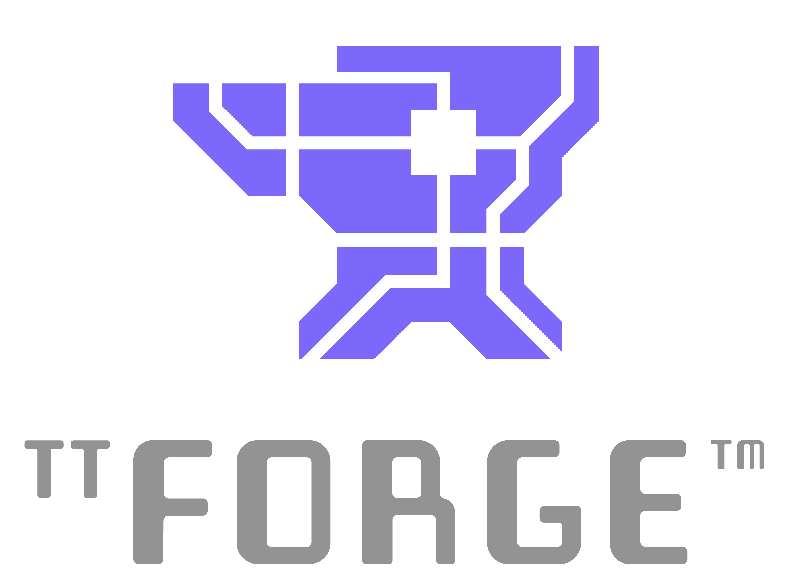

<div align="center">

<h1>

 [Hardware](https://tenstorrent.com/cards/) | [Documentation](https://docs.tenstorrent.com/tt-forge/) | [Discord](https://discord.gg/tenstorrent) | [Join Us](https://job-boards.greenhouse.io/tenstorrent?gh_src=22e462047us) | [Bounty $](https://github.com/tenstorrent/tt-forge/issues?q=is%3Aissue%20state%3Aopen%20label%3Abounty)

</h1>
<picture>
  
</picture>

</div>
<br>

TT-Forge is Tenstorrent's MLIR-based compiler. It integrates into various compiler technologies from AI/ML frameworks, to both enable running models and create custom kernel generation.

-----
# Quick Links
- [Getting Started / How to Run a Model](https://docs.tenstorrent.com/tt-forge/getting_started.html)
- [Interactive Tenstorrent Software Diagram](#interactive-tenstorrent-sofware-architecture-diagram)
- [TT-XLA](https://github.com/tenstorrent/tt-xla) - (single and multi-chip) For use with PyTorch and JAX.
- [TT-Forge-FE](https://github.com/tenstorrent/tt-forge-fe) - (single chip only) For use with ONNX and PaddlePaddle, it also runs PyTorch, however it is recommended to use TT-XLA for PyTorch
- [TT-MLIR](https://github.com/tenstorrent/tt-mlir) - Open source compiler framework for compiling and optimizing machine learning models for Tenstorrent hardware
- [TT-Metal](https://github.com/tenstorrent/tt-metal) - Low-level programming model, enabling kernel development for Tenstorrent hardware
- [TT-TVM](https://github.com/tenstorrent/tt-tvm) - A compiler stack for deep learning systems designed to close the gap between the productivity-focused deep learning frameworks, and the performance and efficiency-focused hardware backends
- [TT-Torch](https://github.com/tenstorrent/tt-torch) - (Deprecated) Previously for use with PyTorch. It is recommended that you use TT-XLA for PyTorch.

-----
# What Is This Repo?
This repository is the central hub for the TT-Forge compiler project, bringing together its various sub-projects into a cohesive product. Here, you'll find releases, demos, model support, roadmaps, and other key resources as the project evolves. Please file any issues with questions or feedback you may have [here](https://github.com/tenstorrent/tt-forge/issues).

# Getting Started Guide
See the documentation available for individual front ends in the [Front End](#current-ai-framework-front-end-projects) section to get started running some tests. You can also try running a demo using the [TT-Forge Getting Started](https://docs.tenstorrent.com/tt-forge/) page.

# Project Goals
- Provide abstraction of many different frontend frameworks
- Generically compile many kinds of model architectures without modification and with good performance
- Abstract all Tenstorrent device architectures

# Project Overview

TT-Forge is composed of various projects ranging from front ends to support popular third-party AI Frameworks, MLIR compiler project, performance optimizations and tools to support the project. tt-forge lowers to our TT-Metalium project, providing additional functionality to our AI Sofware ecosystem.


# Interactive Tenstorrent Sofware Architecture Diagram
Overview of Tenstorrent's Opensource AI software ecosystem.
Click on components to navigate to their repositories:


# FAQ

- Can the user set dtype? How?
  - Datatypes are generally inferred by the front end framework. However,
    certain front ends provide options to override the default datatype
    selection.  See next bullet for an example.
  - Enable bfp8 conversion using compile options. The model **MUST** be cast to bfloat16 before compilation.
```python
torch_xla.set_custom_compile_options({
    "enable_bfp8_conversion": "true",  # Enable bfloat8_b for the whole model
    "experimental_enable_weight_bfp8_conversion": "true",  # Enable bfloat8_b for just model weights
})
```

- How to set shard configs?
  - In tt-xla, sharding can be configured using the `xs.mark_sharding` function
    from the `torch_xla` module. Here's an example of how to set shard
    configurations:
```python
import torch_xla.distributed.spmd as xs
import torch_xla.core.xla_model as xm
import torch_xla.runtime as xr
from infra.utilities.torch_multichip_utils import enable_spmd, get_mesh

xr.set_device_type("TT")
enable_spmd()
device: torch.device = xm.xla_device()
mesh: Mesh = get_mesh((1, xr.global_runtime_device_count()), ("batch", "model"))
xs.mark_sharding(my_input_tensor, mesh, ("model", None))
```
  - [See example model](https://github.com/tenstorrent/tt-xla/tree/main/tests/torch/models/llama3/test_llama_step_n300.py)

- Is there a way to visualize the graph?
  - Yes, you can use `tt-explorer` to visualize and analyze the compiled graphs.
    It provides a user-friendly interface to inspect the model structure,
    operations, and performance metrics.
  - See the [TT-MLIR Explorer docs pages](https://docs.tenstorrent.com/tt-mlir/tt-explorer/tt-explorer.html) for more information.

- User’s responsibilities, and what happens if they do the wrong thing (this was asked both for sharding and data types)
  - Users are responsible for ensuring that their models are compatible with
    the Tenstorrent hardware and software stack. This includes adhering to
    supported data types, model architectures, and sharding configurations.
  - If a user configures their model incorrectly (e.g., using unsupported
    data types or sharding strategies), they may encounter compilation errors,
    runtime errors, incorrect results, or suboptimal performance. It is recommended to refer to
    the documentation and examples provided for guidance on best practices.

- Will forge_fe be deprecated?
  - No, TT-Forge-FE will not be deprecated. It will continue to be supported
    for single-chip configurations and for frameworks such as ONNX, PaddlePaddle, and
    TensorFlow. However, for PyTorch and Jax models, it is recommended to use TT-XLA,
    especially for multi-chip configurations.

# Current AI Framework Front End Projects
- [TT-XLA](https://github.com/tenstorrent/tt-xla)
  - TT-XLA is the primary frontend for running PyTorch and JAX models. It leverages a PJRT interface to integrate JAX (and in the future other frameworks), TT-MLIR, and Tenstorrent hardware. It supports ingestion of JAX models via jit compile, providing StableHLO (SHLO) graph to TT-MLIR compiler. TT-XLA can be used for single and multi-chip projects.
  - See the [TT-XLA docs pages](https://docs.tenstorrent.com/tt-xla) for an overview and getting started guide.

- [TT-Forge-FE](https://github.com/tenstorrent/tt-forge-fe)
  - A TVM based graph compiler designed to optimize and transform computational graphs for deep learning models. Supports ingestion of ONNX, TensorFlow, PaddlePaddle and similar ML frameworks via TVM ([TT-TVM](https://github.com/tenstorrent/tt-tvm)). It also supports ingestion of PyTorch, however it is recommended that you use TT-XLA. TT-Forge-FE does not support multi-chip configurations; it is for single-chip projects only.
  - See the [TT-Forge-FE docs pages](https://docs.tenstorrent.com/tt-forge-fe/getting-started.html) for an overview and getting started guide.

- [TT-Torch](https://github.com/tenstorrent/tt-torch) - (deprecated)
  - A MLIR-native, open-source, PyTorch 2.X and torch-mlir based front-end. It provides stableHLO (SHLO) graphs to TT-MLIR. Supports ingestion of PyTorch models via PT2.X compile and ONNX models via torch-mlir (ONNX->SHLO)
  - See the [TT-Torch docs pages](https://docs.tenstorrent.com/tt-torch) (deprecated) for an overview and getting started guide.

# [TT-MLIR](https://github.com/tenstorrent/tt-mlir) Project

At its core TT-MLIR is our compiler that is interfacing with TT-Metal our opens source low level AI Hardware SDK. TT-MLIR provides a solution for optimizing machine learning and other compute workloads for all tenstorrent hardware. TT-MLIR bridges the gap between all different ML Frameworks and Tenstorrent Hardware. TT-MLIR is broken into different dialects:

- TTIR Dialect: Our common IR that can then be lowered into multiple different backends

- TTNN Dialect: Our entry point into the TTNN Library of Ops

- TTMetalium Dialect: Our entry point into directly accessing tt-metalium kernels.

The compiler employs various optimization passes, including layout transformation, operation fusing, decomposition, and sharding, ensuring the efficient lowering to the target dialect.​

## TT-MLIR Tools and Capabilities

- TTMLIR-Opt: This tool is used to run the TT-MLIR compiler passes on **.mlir** source files and is central to developing and testing the cmpiler.​

- TTMLIR-Translate: TTMLIR-Translate allows us to ingest something (e.g., code) into MLIR compiler, and produce something (for example, executable binary, or even code again) from MLIR compiler.​

- TTRT: It is a standalone runtime tool that can inspect and run compiler executable files without front-end.​

- TT-Explorer: It provides a “Human-In-Loop” interface such that the compiler results can be actively tuned and understood by the person compiling the model.​

- TTNN-Standalone: This is a post-compile tuning/debugging tool for C++ TTNN generated code.

-----
# Tenstorrent Bounty Program Terms and Conditions

This repo is a part of Tenstorrent’s bounty program. If you are interested in helping to improve TT-Forge, please make sure to read the [Tenstorrent Bounty Program Terms and Conditions](https://docs.tenstorrent.com/bounty_terms.html) before heading to the issues tab. Look for the issues that are tagged with both “bounty” and difficulty level!
