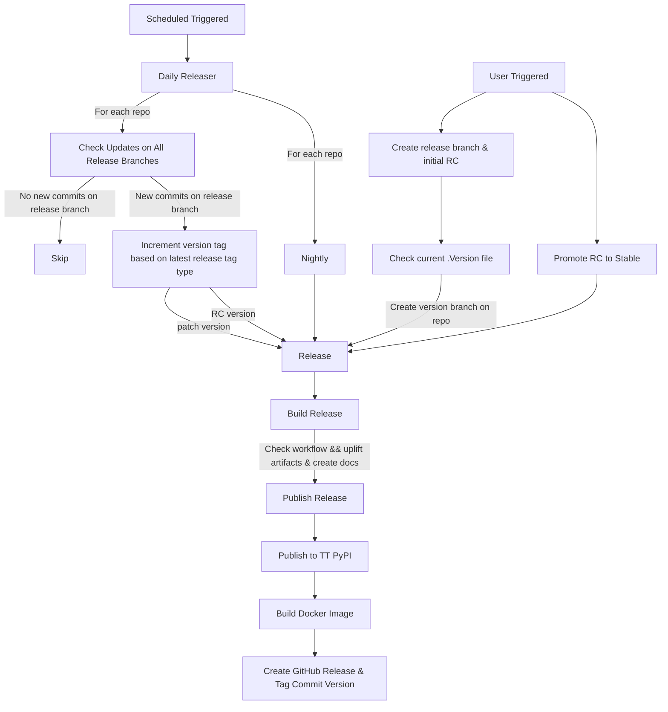

# Release Lifecycle

## Table of Contents

- [Overview](#overview)
  - [Supported Repositories](#supported-repositories)
  - [Workflow Diagram](#workflow-diagram)
- [Core Release Processes](#core-release-processes)
  - [Daily Releaser](#daily-releaser)
  - [Creating a Release Branch & Initial RC](#creating-a-release-branch--initial-rc)
  - [Promoting a Release Candidate to Stable](#promoting-a-release-candidate-to-stable)
- [Maintainer's Guide](#maintainers-guide)
  - [Testing Workflows](#testing)
  - [Common Workflows](#common-workflows)
  - [Common Actions](#common-actions)
  - [Unique Actions](#unique-actions)
- [Release Versioning Reference](#release-versioning-reference)
  - [Version Format](#version-format)
- [Troubleshooting](#troubleshooting)
  - [Common Issues](#common-issues)
  - [Getting Help](#getting-help)

## Overview

The release lifecycle is a series of automated workflows that manage the creation, promotion, and release of software versions for tt-forge repositories. The system handles the entire process from nightly builds to release candidates to stable releases with minimal manual intervention.

### Supported Repositories

Currently this release process manages the release for the following repositories:

- tt-forge
- tt-forge-fe
- tt-torch
- tt-xla
- tt-mlir

### Workflow Diagram

## Core Release Processes

### Daily Releaser

This [workflow](.github/workflows/daily-releaser.yml) manages automated releases and version updates.

#### Process Overview
The daily releaser is a scheduled job that is responsible for release lifecycle management of nightly releases and updating release candidate numbers (e.g., RC1 to RC2) and/or patch version numbers (e.g., 0.1.0 to 0.1.1).

##### Updates RC/Beta release branch tags
Monitors release branches for new commits. When a new commit is detected, it verifies that the associated workflows have passed successfully. For release branches where the current tag is a release candidate (e.g., `X.Y.0rc1`), it increments the release candidate version (e.g., RC1 to RC2) and creates a new GitHub pre-release with the new tag. For stable release branches, it increments the patch version (e.g., 0.1.0 to 0.1.1) and creates a new GitHub release with the new tag. This automated process ensures continuous delivery of bug fixes and improvements while maintaining quality through workflow validation.

To learn more about release branches, see the [Creating a Release Branch & Initial RC](#creating-a-release-branch-initial-rc) section.

##### Nightly
Generates nightly builds from a repo's main branch. These nightly releases are tagged with a date-based version (e.g., 0.1.0dev20250708) and provide the latest features and/or fixes for testing purposes. Nightly builds are published with GitHub pre-release status and include the most recent code changes without test validation.

### Creating a Release Branch & Initial RC

This [workflow](.github/workflows/create-version-branches.yml) manages the creation of new release branches and their initial release candidates.

Release branches represent stabilized versions of a forge project and follow a naming convention of `release-X.Y`. Creating a release branch is the first step in the release process and is initiated through the [create-version-branches.yml](.github/workflows/create-version-branches.yml) workflow.

#### Process Overview

1. **Branch Creation:** A new branch is created with the format `release-X.Y` where X is the major version and Y is the minor version. These values are derived from tt-forge `.version` file.

2. **Commit Selection:** The system automatically selects the most suitable commit from a repository's main branch to use as the base for the release branch:
   - By default, it finds the most recent successful workflow set in [set-release-facts.yml](.github/workflows/set-release-facts.yml) run on the main branch
   - Alternatively, a specific commit can be provided explicitly and/or override the workflow defaults in for a repo.
   - The workflow validates that all CI checks passed for the selected commit from [find-workflow.yml](.github/actions/find-workflow)
   - Artifacts from the workflow run are verified to ensure build products are available

3. **Initial Release Build:** The system triggers a build for this first RC, producing artifacts that will be published as a GitHub pre-release. An initial release candidate tag (`X.Y.0rc1`) is automatically generated, marking the first pre-release for testing.

#### Usage

To create a release branch, you can either:

- Trigger the workflow manually through GitHub Actions UI, specifying the target repository
- Use the workflow programmatically as part of a larger release process

If the specified release branch already exists, the system will skip the branch creation step. If you need to recreate an initial release candidate, you will need to delete the release branch, tag, and GitHub release in the repository and re-run the workflow.

> **Note:** Once created, release branches are automatically monitored by the daily releaser process for new commits.

### Promoting a Release Candidate to Stable

This [workflow](.github/workflows/promote-stable.yml) is responsible for elevating a release candidate (RC) to stable status after it has been thoroughly tested.

#### Promotion Process

1. **Verification:** The system first verifies that:
   - The specified branch is a valid release branch (`release-X.Y`)
   - The current tag on the branch is a release candidate (`X.Y.0rcN`)
   - The latest commit on the branch matches the commit of the RC tag

2. **Version Transformation:** When promoting:
   - The stable format version tag is created (`X.Y.0`) is used based on the [.version](.version) file
   - The `make_latest` flag is set to true for the stable release

3. **Release Publishing:** The system triggers a build with release type 'stable' which:
   - Creates new artifacts or reuses the artifacts from the RC
   - Updates the version in wheels and packages
   - Publishes to PyPI with the stable version number
   - Creates a GitHub release with the stable tag
   - Builds and publishes Docker images marked as 'latest'

#### Usage

To promote a release candidate to stable:

1. Ensure that the RC has been thoroughly tested and approved
2. Trigger the `promote-stable.yml` workflow manually through the GitHub Actions UI
3. Specify the target repository and the release branch name

> **Note:** Once promoted to stable, the release branch continues to be monitored by the daily releaser for patch updates (e.g., `X.Y.1`, `X.Y.2`) as needed.

## Maintainer's Guide

### Testing

#### Test Nightly Releaser

This [workflow](.github/workflows/test-nightly-releaser.yml) allows testing of a nightly release process without triggering actual production nightly releases. This workflow verifies that the nightly build workflow functions correctly across all repositories.

What this workflow does:

- Generate builds from a repository's main branch
- Tag builds with date-based versions (e.g., draft.tt-forge-fe.0.1.0dev20250708)
- Simulate the publishing process with draft status so the github release page can be view in tt-forge repository.

What this workflow does not do:

- Publish to PyPI
- Build Docker images

#### Test RC/Stable Release Lifecycle

This [workflow](.github/workflows/test-rc-stable-release-lifecycle.yml) allows testing of the RC to stable release promotion process without triggering actual production releases. This workflow verifies that the RC to stable build workflow functions correctly. Currently we only use tt-mlir for this test.

What this workflow does:

- Uses create version branch tag to create the tag initial tag (e.g., 0.1.0rc1) and a draft release of RC1
- Simulates a user commit and workflow success on release branch (e.g draft-tt-mlir.0.1.0rc1)
- Runs update release branch to create RC2 and a draft release of RC2
- Promote the RC2 to stable and create a stable draft release (e.g draft-tt-mlir.0.1.0)

### Common Workflows

#### Release

This [workflow](.github/workflows/release.yml) is the central orchestrator for all types of releases (nightly, RC, and stable) across tt-forge repositories. It is a reusable workflow that handles the entire release process from building artifacts to publishing them through various channels.

What this workflow does:

- Coordinates the complete release process for a repository
- Builds release artifacts by calling the build-release action
- Publishes Python packages to Tenstorrent's PyPI repository (for non-draft releases)
- Builds and pushes Docker images with appropriate tags (for non-draft releases)
- Creates GitHub releases with all artifacts and documentation
- Handles draft mode for testing the release process without affecting production
- Supports overwriting existing releases when necessary

### Common Actions

#### Set Release Facts

This [action](.github/actions/set-release-facts) establishes standardized configuration parameters for the release process across all repositories. It serves as a central configuration source that determines how releases are built and tagged.

What this action does:

- Reads the `.version` file to determine current major/minor version numbers
- Sets repository-specific parameters (workflow names, artifact patterns, package names)
- Configures version tag formats based on release type (nightly, RC, stable):
  - RC versions: `X.Y.0rc1`, `X.Y.0rc2`, etc.
  - Stable releases: `X.Y.0`, `X.Y.1`, etc. (semantic versioning)
  - Nightly builds: `X.Y.0.devYYYYMMDD` (date-based versioning)
- Determines prerelease status and Docker image tagging (latest flag)
- Provides consistent outputs for downstream workflows including:
  - Repository information (short names, full paths)
  - Version information (major/minor versions, build tags)
  - Artifact handling parameters
  - Workflow configuration settings

This centralized approach ensures consistent behavior across all repositories in the tt-forge ecosystem and simplifies maintenance of the release process.

#### Git Facts

This [action](.github/actions/git-facts/action.yml) and/or [script](.github/scripts/git_facts.sh) retrieves git information about a repository. This information is essential for workflows that need to make decisions based on the current state of a branch, such as determining whether new commits have been added since the last release, or verifying that a release tag points to the expected commit.

What this action does:

- Retrieves the latest commit on a specified branch
- Identifies the most recent release tag in the branch's history
- Determines the commit associated with the latest release tag
- Checks whether the latest branch commit matches the latest release tag commit
- Exposes these values as outputs for other workflows to consume

#### Find Workflow

This [action](.github/actions/find-workflow/action.yml) locates suitable workflow runs in repository for release purposes. It's crucial for identifying workflows that have completed successfully and/or have produced artifacts for release purposes.

What this action does:

- Searches for workflow runs based on repository, branch/commit, and workflow name criteria
- Validates that found workflows have completed successfully (or accepts failed workflows if configured)
- Verifies that workflows have produced artifacts (unless artifact checking is disabled)
- Returns information about the selected workflow run, including its ID, URL, and commit SHA
- Supports filtering to specific job results within a workflow

#### Get Repos

This [action](.github/actions/get-repos/action.yml) retrieves a list of repositories from the tt-forge organization. It's useful for operations that need to iterate over multiple repositories, such as release processes or batch operations.

What this action does:

- Fetches a list of repositories from the tt-forge organization
- Returns the list of repositories as an output

#### Get Release Branches

This [action](.github/actions/get-release-branches/action.yml) identifies and analyzes all release branches in a repository to determine which ones need version updates. This action provides the foundation for the daily releaser's update release branch workflow to automatically identify which branches need new releases and what version numbers should be assigned to those releases.

What this action does:

- Finds all release branches in a repository (following the `release-X.Y` naming convention)
- For each branch, checks if there are new commits since the last release tag
- Determines the release type (RC or stable) based on the current release tag
- Calculates the appropriate new version tag based on release type:
  - For RC branches: Increments the RC number (e.g., 0.1.0rc1 → 0.1.0rc2)
  - For stable branches: Increments the patch version (e.g., 0.1.0 → 0.1.1)
- Returns a structured JSON with detailed information about branches requiring updates

#### Build Release

This [action](.github/actions/build-release/action.yml) is responsible for constructing release artifacts from successful workflow runs. It serves as the central orchestrator of the release build process, coordinating several sub-actions.

What this action does:

- Sets up release configuration using the [set-release-facts](.github/actions/set-release-facts/action.yml) action
- Locates an appropriate workflow run to use as the source for release artifacts
- Uplifts artifacts from the source workflow run
- Updates wheel version numbers to match the target release version
- Generates compatible hardware tables for documentation (when applicable)
- Creates release documentation including changelog and installation instructions
- Stores all release artifacts for subsequent publishing steps

#### Uplift Artifacts

This [action](.github/actions/uplift-artifacts/action.yml) uplifts build artifacts from completed workflow runs to the release process. It handles artifact retrieval, extraction, and preparation.

What this action does:

- Downloads artifacts from specified workflow runs using configurable glob patterns
- Extracts compressed archives (tar, tar.gz, zip) automatically
- Cleans up unwanted files and directories based on configurable patterns
- Organizes artifacts in a standardized directory structure for the release process

#### Update Wheel Version

This [script](.github/scripts/wheel-version-updater.sh) dynamically updates version numbers in Python wheel packages to ensure consistent versioning across all artifacts in a release. This script ensures that all Python packages included in a release have consistent version numbers, regardless of when or how they were originally built.

What this script does:

- Locates all Python wheel files (*.whl) within a specified directory structure
- Unpacks each wheel package to access its metadata
- Updates the version information to match the specified release version
- Renames internal directories to reflect the new version
- Repacks the wheels with the updated version information

#### Docs Generator

This [action](.github/actions/docs-generator/action.yml) creates release documentation that is used in the GitHub release page.

What this action does:

- Determines appropriate version tags for changelog generation
- Builds a detailed changelog using commit history between versions
- Categorizes changes into Features, Fixes, Maintenance, etc. based on commit labels
- Generates pip installation instructions for all included Python packages
- Includes Docker container references when applicable
- Lists all files included in the release
- Provides links to documentation and relevant workflow runs

#### Docker Build Push

This [action](.github/actions/docker-build-push/action.yml) builds and publishes Docker images for releases, ensuring that every release has a corresponding Docker image with the appropriate tags.

What this action does:

- Builds Docker images using release artifacts and custom Dockerfiles
- Optimizes CI pipelines by checking if images already exist before rebuilding
- Applies appropriate tags to images based on release type and version
- Optionally adds 'latest' tag for stable releases
- Reports image sizes and layer information for transparency
- Supports customization through build arguments

Docker images provide a consistent environment for running tt-forge software, making it easier for users to get started without managing complex dependencies.

#### Publish Tenstorrent Pypi

This [action](.github/actions/publish-tenstorrent-pypi/action.yml) uploads Python wheel packages to Tenstorrent's private PyPI repository for distribution.

What this action does:

- Uploads wheel packages to the S3-backed PyPI repository
- Verifies that uploaded packages are discoverable and accessible
- Supports overwriting existing packages when necessary

#### Publish GitHub Release Page

This [action](.github/actions/publish-github-release/action.yml) creates or updates GitHub release pages with all artifacts, documentation, and appropriate version tags. It's the final step in making a release publicly available.

What this action does:

- Sets appropriate naming conventions based on release type (nightly, RC, stable)
- Uploads all artifacts to a GitHub release page
- Attaches the generated documentation as the release description
- Properly tags releases with the correct version
- Controls release status (draft, prerelease, latest)
- Handles different repository targeting for draft vs. production releases

#### Random

This [action](.github/actions/random/action.yml) generates unique identifiers for testing workflows, particularly for draft releases.

What this action does:

- Creates a timestamp-based unique identifier when running in draft mode
- Ensures that artifacts from test releases have unique names to avoid collisions
- Returns an empty ID for production runs to maintain consistent artifact naming

#### Create RC Branch

This [action](.github/actions/create-rc-branch/action.yml) manages the creation of release candidate branches and their initial tags. It's a key component in starting the formal release process for a repository.

What this action does:

- Creates a new release branch following the `release-X.Y` naming convention
- Automatically generates the initial RC tag (e.g., `X.Y.0rc1`) for the branch
- Finds an appropriate workflow run to use as the source commit for the release branch
- Handles draft mode for testing the release branch creation process
- Verifies if a release branch already exists to prevent accidental recreation
- Returns branch and tag information for downstream release processes

### Unique Actions

#### TT Forge Wheel

This [action](.github/actions/tt-forge-wheel/action.yml) specifically handles the building of the tt-forge Python wheel package. It's a specialized action for creating the core package that integrates all tt-forge components.

What this action does:

- Waits for dependent frontend wheels to be available on the Tenstorrent PyPI repository
- Generates a setup.py file from a [template](.github/scripts/template-setup.py) with proper version information
- Builds source distribution and wheel packages
- Installs and verifies the wheel package as a basic validation step

## Release Versioning Reference

The tt-forge release system follows semantic versioning patterns with additional conventions for different release types:

### Version Format

- **Nightly Builds**: `X.Y.0.devYYYYMMDD`
  - Example: `0.1.0.dev20250708`
  - Automatically generated from the main branch daily
  - Tagged as pre-releases in GitHub

- **Release Candidates**: `X.Y.0rcN`
  - Example: `0.1.0rc1`, `0.1.0rc2`
  - Created on release branches (`release-X.Y`)
  - RC number increments automatically when new commits are detected
  - Tagged as pre-releases in GitHub

- **Stable Releases**: `X.Y.Z`
  - Initial stable: `X.Y.0` (promoted from an RC)
  - Patch releases: `X.Y.1`, `X.Y.2`, etc.
  - Tagged as full releases in GitHub
  - Docker images tagged as `latest` for the most recent stable release

For more details on the release process, see the [Core Release Processes](#core-release-processes) section.

## Troubleshooting

### Common Issues

#### Failed Release Creation

If a release creation fails, check the following:

1. **Workflow Status**: Ensure the source workflow completed successfully
2. **Artifacts**: Verify that all expected artifacts were generated
3. **Version Conflicts**: Check if the release version already exists

To resolve these issues, you may need to delete conflicting tags/releases before retrying.

#### Skipped Version Updates

If the daily releaser is not updating versions as expected:

1. **Workflow Status**: Ensure workflows on the release branch are completing successfully
2. **Commit Detection**: Verify that new commits have been made to the release branch
3. **Branch Format**: Confirm the branch follows the `release-X.Y` naming convention

### Getting Help

For additional assistance with release issues, contact the Forge DevEx team or file an issue on the tt-forge repository.
